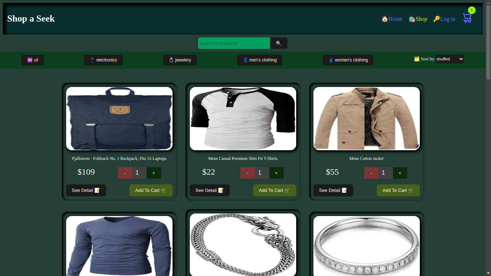

# shopping-cart

Classic Mock Shopping cart built using React + Vite and packaged with fetching, routing, testing, css module styling, prop validation using propTypes and some other ingredients


## Description

1. This is mock e-commerce website built to use react concepts as in curricullar progress of TOP
2. This project used vite as build tool
3. This shop isn't the real one where you can shop items seriously, it is just for learning purpose  you might use it for so as well.
4. It resembles partially the real one to get in to the track of how  real one's development might be.
5. Here there is only front end with client side routing uses css modules proptypes and others for styling, type-checking and for other purposes

## Table of contents

[Description](#description)
[Features](#features)
[Screenshots](#screenshot)
[Installation](#installation)
[API Documentation](#api-documentation)
[Contributing](#contributing)
[License](#license)
[Live Demo](#live-demo)

## Features
- You might get less out of what has to be included in normal ecommerce website below are features already included in this website
- This website got a home page with ad visuals for users to get in to shopping
- ``image carousel``: shows which types of products they may shop, forth and back buttons with it
- ``Featured products``: random products out of store's api end point  and ``call to action`` leading to shopping section.
- ``Shopping section``: There is a bar to categorize which type of product you want to see and assortment on how you want to see it:- price-wise, alphabetically, or as it it is come.
- ``Searching products``: This feature might be a little poor when it comes to the algorithm's efficiency, as it tries to find products which containes letters used as searching keyword and finally tries to match with products title. Simply, it finds a product contains a letter in search keys arbitrarily than a word or related terms.
- And there is login and checkout forms you can skip, or work on it to extend its function
- And like an ordinary shopping site there is a cart section where the selected products live. Counting and resetting are one of things tied with the cart items

## Screenshot

Here is the minimal and optimal overview for the app.




## Installation

To install the package, use the following steps
1. open your terminal in VS code( if you use so):
    `ctrl + backtick`

2. Then do

```bash
npm install
```

3. To Run the app in your dev server

```bash
npm run dev
```

## API Documentation
- This project works by fetching products from an api end point, [fakestoreapi](https://fakestoreapi.com/),
- [icon finder](https://www.iconfinder.com/) and [EmojiDB](https://emojidb.org/) are also websites I used for favicon and emojies.

## Contributing

1. Fork
2. Optimize per use suitability in your local machine
3. And code around limitlesslly

## License
This project is licensed under the [MIT License](https://github.com/Uwancha/memory-card/blob/main/LICENSE).Feel free to play around manipulating it.

## Live Demo

[Hit here](https://shopasick.netlify.app/)
